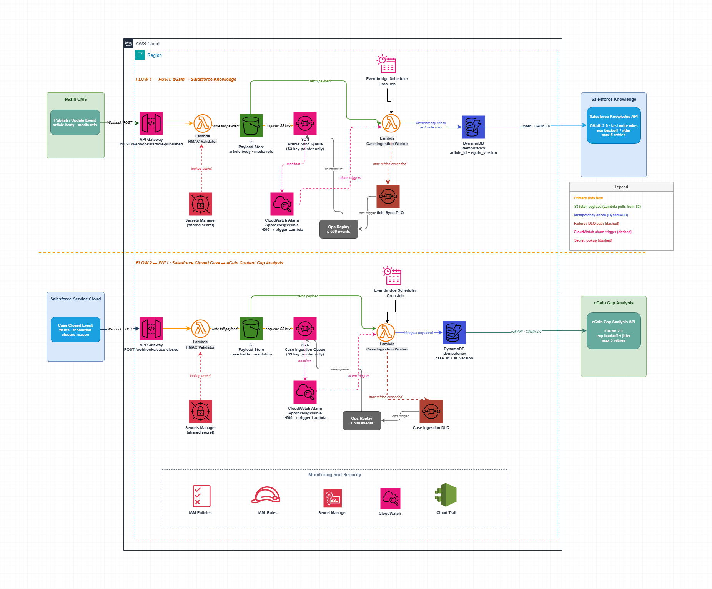
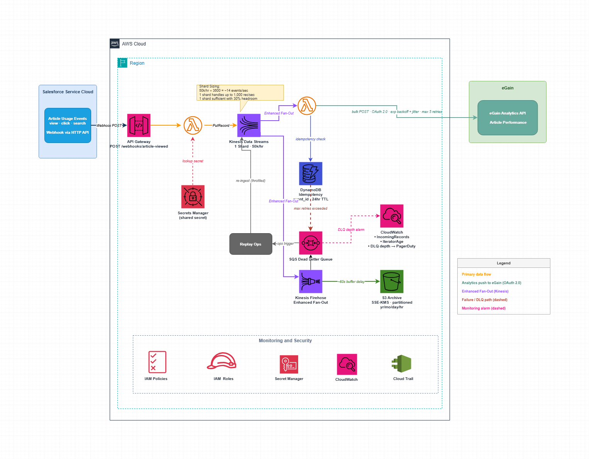

# Architecture Decisions

## [ADR-001](architecture/ADR-001-egain-salesforce-bidirectional-sync.md) — Bidirectional sync between eGain and Salesforce Knowledge

**Physical Architecture**

## [ADR-002](architecture/ADR-002-stream-article-analytics-to-egain.md) — Stream article usage analytics to eGain in real time

**Physical Architecture**

